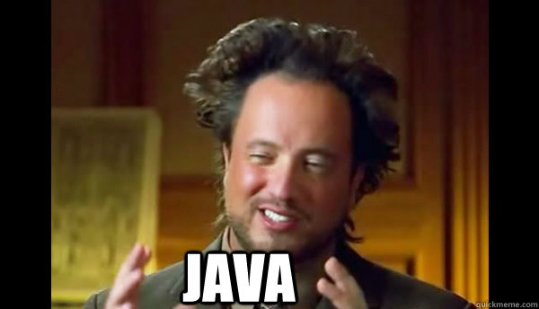

# Phaseten

### Ein Componentware-Projekt von:
Robin Harbecke, Daniela Kaiser, Sven Krefeld, Björn Merschmeier, Marc Mettke, Tim Prange, Dennis Schöneborn und Sebastian Seitz

---

## Agenda:

- Vorstellung der Gruppe
- Spielidee
- Architektur
- GUI
- Spiellogik
- AI
- Datenhaltung
- Schluss

---

# Überschrift 1
## Überschrift 2
### Überschrift 3

---

Dies ist normaler Text
- Dieser ist eingerückt
  + Dieser ist eine Ebene weiter eingerückt
  
Absätze könnt ihr einfach durch Leerzeilen erzeugen

---

- [Links](http://gph.to/2DJZeDS) könnt ihr ganz einfach so setzen
- und Bilder fast genau so

- Ihr könnt sie auch als Hintergrund setzen wie auf der nächsten Folie

---?image=assets/image/beispiel_bild2.jpg&size=auto 80%

- Beispieltext

---?code=src/GameValidationBean.java&lang=java&title=GameValidationBean

@[1-3,5](Code könnt ihr auch ganz einfach einbinden)
@[8-10](Und bestimmte Zeilen hervorheben)

---

Zum Schluss fehlen noch Notizen, drückt einfach mal "S"

Bei Fragen schaut einfach mal im [Wiki](https://github.com/gitpitch/gitpitch/wiki) vorbei oder fragt mich

Note:
- Pssst! Ich bin eine geheime Notiz

---

## Vorstellung der Gruppe
- Robin Harbecke
- Daniela Kaiser
- Sven Krefeld
- Björm Merschmeier
- Marc Mettke
- Tim Prange
- Dennis Schöneborn
- Sebastian Seitz

---

## Spielidee

---

## Architektur

---

## Client/Server Kommunikation

---

## GUI

---

## Spiellogik

---

## AI

---

### Allgemeine Logik

- Funktion zur Deckbewertung
- Eigentliche Spielmethoden

---

### Spielmethoden

- Ziehe Karte
  + Berechne Deckwert mit vorgegebener Karte
  + Deckwerte mit allen Zufallskarten
  + Mittelwert der Zufallsergebnisse
  + Vergleichen und wählen

---

### Spielmethoden
- Lege Phase
  + Bewerte Karten für die Ablage als Phase
  + Gefundene Möglichkeit ablegen
- Lege Karten zu Stapel
  + Lege alle Karten auf mögliche Stapel

---

### Spielmethoden

- Karte auf Ablegestapel legen
  + Für jede Karte
  + Bewerte Deck ohne diese Karte
  + Lege die Karte ab mit dem nächsten Deckwert ohne sie
  
---

### Kartenbewertungsfuntion
- Bewertet ein übergebenes Deck anhand von Spielfelds und Phase
- Je nach Sittuation wir eine andere genommen
  
Bewertungsfunktionen
- Phase noch nicht gelegt
  + Berechne fehlende Karten
  + 100 Minuspunkte pro fehlender Karte
- Phase schon gelegt
  + Ignoriere alle ablegbaren Karten
  + Minuspunkte jeder Karte entsprechen Kartenwert
  
---

## Datenhaltung

---

## Schluss
Vielen Dank für Ihre Aufmerksamkeit.

Fragen?
